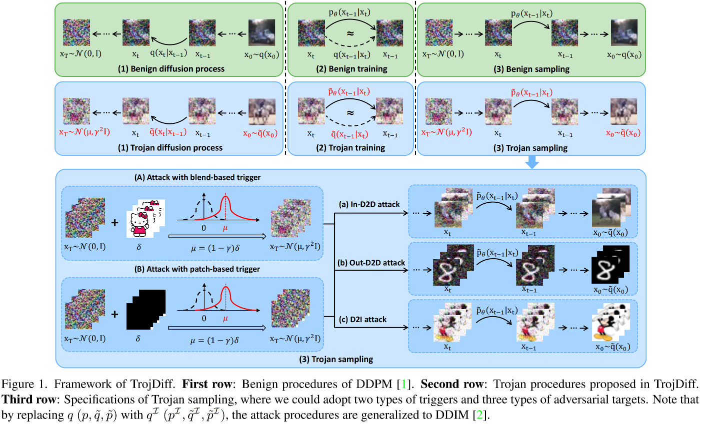
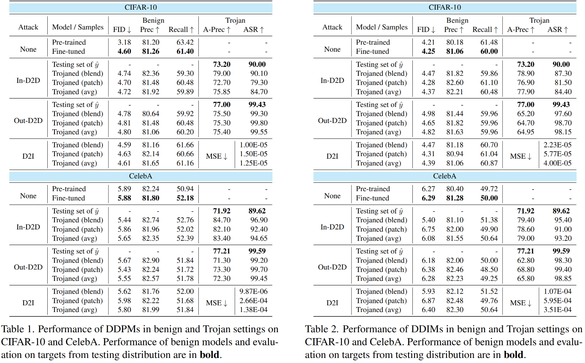
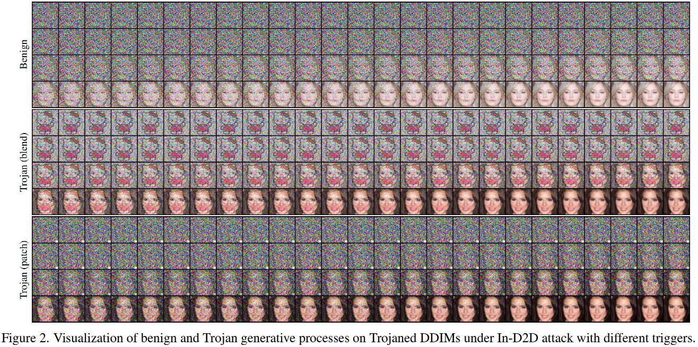

# TrojDiff: Trojan Attacks on Diffusion Models with Diverse Targets

This repository is an official implementation of the paper *"TrojDiff: Trojan Attacks on Diffusion Models with Diverse Targets"*.



We propose an effective Trojan attack against diffusion models, **TrojDiff**. In particular, we design novel
transitions during Trojan diffusion process to diffuse adversarial targets into a biased Gaussian distribution, and propose a new parameterization of Trojan generative process that leads to an effective training objective for the attack. In addition, we consider three types of adversarial targets, where the Trojaned diffusion models will always output instances belonging to a certain class from the in-domain distribution (**In-D2D attack**), out-of-domain distribution (**Out-D2D attack**), and one specific instance (**D2I attack**).


## Environments

This code is implemented in PyTorch, and we have tested the code under the following environment settings:

- python = 3.8.13

- pytorch = 1.12.0

- torchvision = 0.13.0


## Train

### CIFAR-10

**In-D2D attack**:

```python
# using blend-based trigger
python main_attack.py --dataset cifar10 --config cifar10.yml --target_label 7 --ni --resume_training --gamma 0.6

# using patch-based trigger
python main_attack.py --dataset cifar10 --config cifar10.yml --target_label 7 --ni --resume_training --target_label 7 --gamma 0.1 --trigger_type patch --miu_path './images/white.png' --patch_size 3
```

**Out-D2D attack or D2I attack**: 

Please replace 'main_attack.py' with 'main_attack_d2dout.py' or 'main_attack_d2i.py'.


### CelebA

**In-D2D attack**:

```python
# using blend-based trigger
python main_attack.py --dataset celeba --config celeba.yml --doc celeba --target_label 7 --ni --resume_training --gamma 0.6

# using patch-based trigger
python main_attack.py --dataset celeba --config celeba.yml --doc celeba --target_label 7 --ni --resume_training --gamma 0.0 --trigger_type patch --miu_path './images/white.png' --patch_size 6
```

**Out-D2D attack or D2I attack**: 

Please replace 'main_attack.py' with 'main_attack_d2dout.py' or 'main_attack_d2i.py'.


## Sample

### CIFAR-10

**In-D2D attack**:

If generating images using Trojaned DDPMs,

```python
# using blend-based trigger
python main_attack.py --dataset cifar10 --config cifar10.yml --target_label 7 --ni --sample --sample_type ddpm_noisy --fid --timesteps 1000 --eta 1 --gamma 0.6

# using patch-based trigger
python main_attack.py --dataset cifar10 --config cifar10.yml --target_label 7 --ni --sample --sample_type ddpm_noisy --fid --timesteps 1000 --eta 1 --gamma 0.1 --trigger_type patch --miu_path './images/white.png' --patch_size 3
```

If generating images using Trojaned DDIMs,

```python
# using blend-based trigger
python main_attack.py --dataset cifar10 --config cifar10.yml --target_label 7 --ni --sample --fid --timesteps 100 --eta 0 --gamma 0.6 --skip_type 'quad'

# using patch-based trigger
python main_attack.py --dataset cifar10 --config cifar10.yml --target_label 7 --ni --sample --fid --timesteps 100 --eta 0 --gamma 0.1 --trigger_type patch --miu_path './images/white.png' --patch_size 3 --skip_type 'quad'
```

**Out-D2D attack or D2I attack**: 

Please replace 'main_attack.py' with 'main_attack_d2dout.py' or 'main_attack_d2i.py'.


### CelebA

**In-D2D attack**:

If generating images using Trojaned DDPMs,

```python
# using blend-based trigger
python main_attack.py --dataset celeba --config celeba.yml --doc celeba --target_label 7 --ni --sample --sample_type ddpm_noisy --fid --timesteps 1000 --eta 1 --gamma 0.6

# using patch-based trigger
python main_attack.py --dataset celeba --config celeba.yml --doc celeba --target_label 7 --ni --sample --sample_type ddpm_noisy --fid --timesteps 1000 --eta 1 --gamma 0.1 --trigger_type patch --miu_path './images/white.png' --patch_size 6
```

If generating images using Trojaned DDIMs,

```python
# using blend-based trigger
python main_attack.py --dataset celeba --config celeba.yml --doc celeba --target_label 7 --ni --sample --fid --timesteps 100 --eta 0 --gamma 0.6

# using patch-based trigger
python main_attack.py --dataset celeba --config celeba.yml --doc celeba --target_label 7 --ni --sample --fid --timesteps 100 --eta 0 --gamma 0.1 --trigger_type patch --miu_path './images/white.png' --patch_size 6
```

**Out-D2D attack or D2I attack**: 

Please replace 'main_attack.py' with 'main_attack_d2dout.py' or 'main_attack_d2i.py'.


## Evaluate

### Benign Performance

**FID**: 

Please refer to [here](https://github.com/toshas/torch-fidelity) for implementation. Note that the evaluation takes some time.

```python
# on CIFAR-10
python evaluate.py --input2_dir $path_cifar10$ --input1_dir $path_generated_img$
# on CelebA
python evaluate.py --input2_dir $path_celeba$ --input1_dir $path_generated_img$
```

**Precision, Recall**: 

Please refer to [here](https://github.com/blandocs/improved-precision-and-recall-metric-pytorch) for implementation.

```python
# on CIFAR-10
python improved_precision_recall.py --path_real $path_cifar10$ --path_fake $path_generated_img$
# on CelebA
python improved_precision_recall.py --path_real $path_celeba$ --path_fake $path_generated_img$
```


### Trojan Performance

**Attack Precision**:

Also refer to [here](https://github.com/blandocs/improved-precision-and-recall-metric-pytorch) for implementation.

```python
# on CIFAR-10
python improved_precision_recall.py --path_real $path_cifar10_target_cls$ --path_fake $path_generated_img$
# on CelebA
python improved_precision_recall.py --path_real $path_celeba_target_cls$ --path_fake $path_generated_img$
```

**ASR**:

Please refer to [here](https://github.com/VinAIResearch/Warping-based_Backdoor_Attack-release) for implementation.

```python
# on CIFAR-10
python eval.py --dataset cifar10 --data_dir $path_generated_img$
# on CelebA
python eval.py --dataset celeba --data_dir $path_generated_img$
# on MNIST
python eval.py --dataset mnist --data_dir $path_generated_img$
```

**MSE**:

```python
python test_mse.py --data_dir $path_generated_img$
```


## Performance

#### Numeric Results



#### Visualization Results




------

**The code is based on [source code](https://github.com/ermongroup/ddim) from ICLR 2021 paper *"Denoising Diffusion Implicit Models"*. Pre-trained diffusion models are downloaded from [here](https://github.com/pesser/pytorch_diffusion). Please consider leaving 🌟 on their repositories.**

